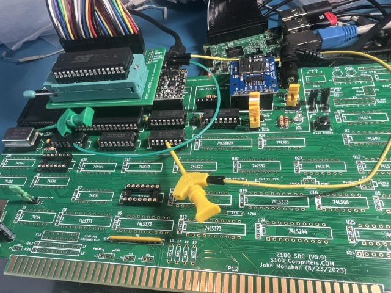
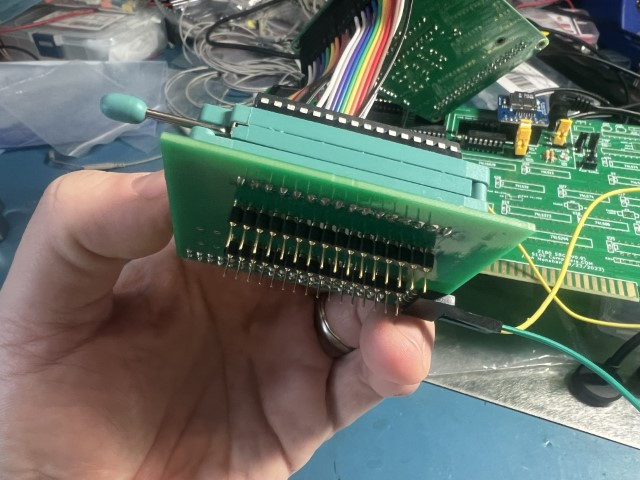
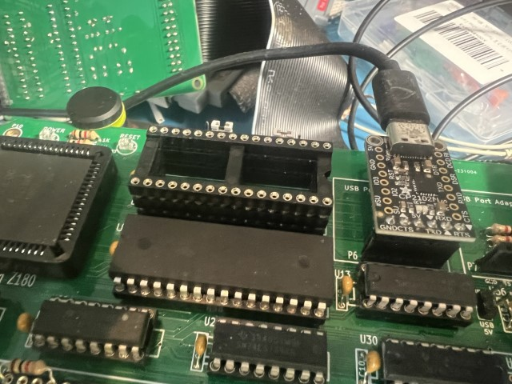
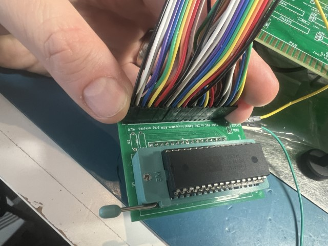
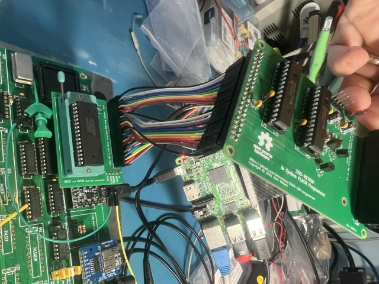
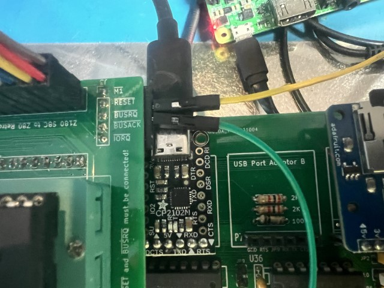
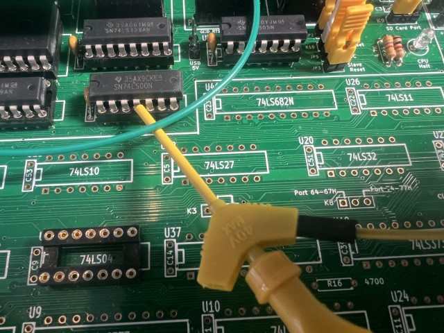
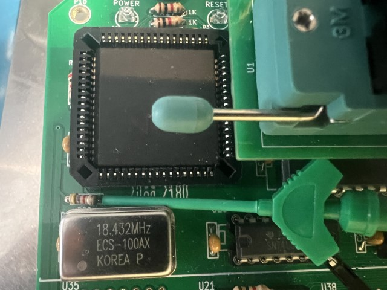

# z180_SBC_ISP_Adapter

Adapter board between s100computers' z180 SBC board and z80-Retro! in-system programmer

This adapter is designed to be placed between the ROM socket of the s100Computers z180 SBC board (https://s100computers.com/My%20System%20Pages/Z180%20SBC/Z180%20SBC1.htm) and the z80-Retro! in-system programmer (https://github.com/Z80-Retro/2065-Z80-programmer) to allow in-system programming of a ROM.

Note that the programmer only suports a 16 bit (64k) address, whereas the ROM on the z180 board supports a 19 bit address (512k).  Accordingly, only the bottom 64k of the ROM chip can be programmed this way.

**J1** should be populated with long header pins below the board (or stacked machined IC sockets work well) that will be inserted into the U3 socket on the z180 SBC board.

**U1** is a 32-pin ZIFF socket, into which the SST39SF040 ROM chip will be placed.

**J2** is a standard 2x20 header, placed above the board, to which the in-system programmer can be attache directly, or with a ribbon cable or dupont leads.

(Note that this is V1.0 of the board, with an incorrect pinout on J2.  Dupont leads are being used to correctly connect the ISP to J2.)

**R1-R3** are pull-down resistors for A16-A18 address lines which cannot be accessed by the programmer.  However, in practice, I have found that they need not be populated.

**J3** can be equipped with header pins or sockets, above or below the board, straight or right angle, as best fits mechanically.  This header pulls out several signals from the programmer that aren't present in the ROM socket.  Only two of these are important - RESET* and BUSREQ*.  The other three signals aren't currently needed but have been placed there for completeness and future-proofing.

The two necessary signals need to be connected to the z180 board using jumper wires and micrograbbers, or similair.  On v0.9 of the z180 SBC, the best place I found to connect these are as follows:  

RESET* to U30, pin 4.  

BUSREQ* to R20 on the "right" leg (the one closer to the interior of the board, away from the edge).  

Note that R20 isn't present on earlier reviisions of the z180 SBC, and therefore a different location must be found for connecting this signal.  Perhaps pin 8 of U21.

Version 1.0 has incorrect pinout for connecting to the programmer, but can be made to work with dupont wires.  Also missing some pullup resistors, HOWEVER, the adapter seems to work fine WITHOUT the resistors installed.

Version 1.1 has fixed the pinout and additional pullup resistor pads, and changed mechanical layout to better fit, but it has not been tested.

